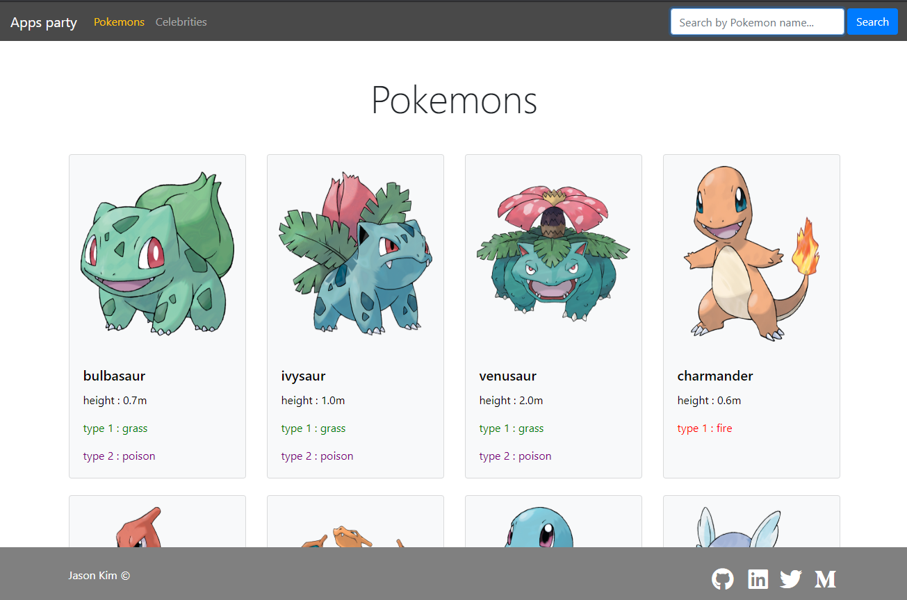
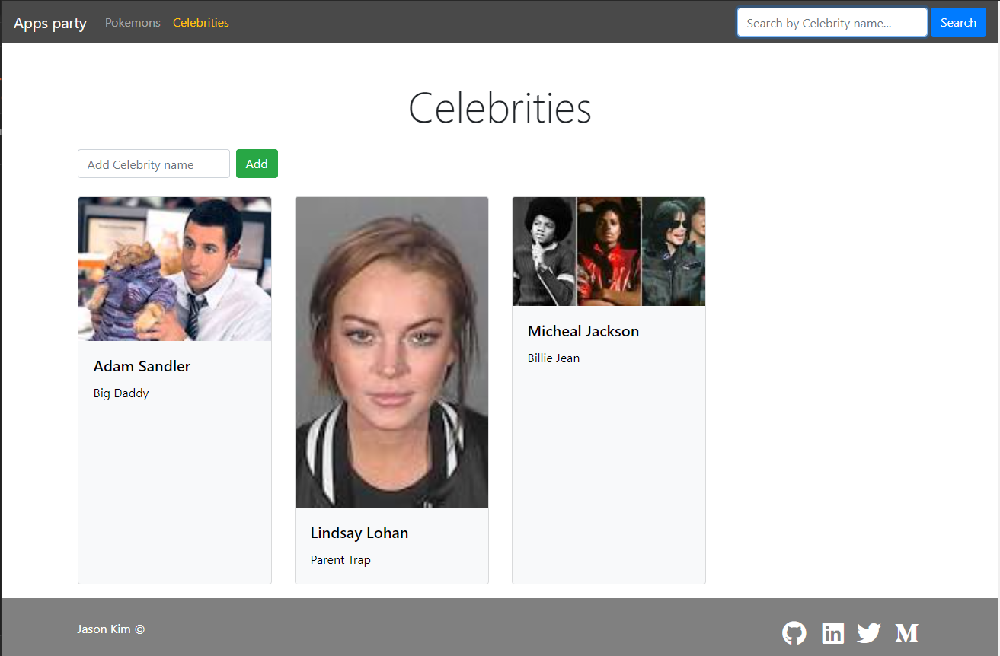

# Small apps with Rails

## Link
### Github link : https://github.com/jasonkim7288/rails_small_apps
### Deploy link : https://smallapps.herokuapp.com/

## Description
Small apps are a collection of apps using different kinds of REST APIs, such as Pokemons, Wikipedia, Google Image Search APIs.

<!--  -->

## Screenshot

## Tech stack
- Rails : Front end and back end source code
- Heroku : deploy the code
- Bootstrap : make pages look prettier
- Httparty : a gem for REST API request 
- uuid : a gem for making unique ID for each element